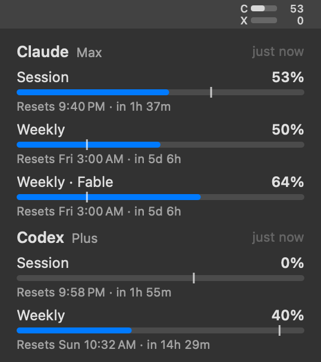

# headroom

A simple menu bar app for your Claude and Codex usage limits.



The menu bar shows one row per provider: how much of the current session
window is used. The other windows (weekly, model-scoped) are in the menu.
Rows turn orange at 75% and red at 90%. "Show Numbers in Menu Bar" drops the
percentages and leaves just the bars, for a narrower icon.

Click for every limit, when each resets, and a pace tick on each bar: the
tick is how far through the window the clock is, so a fill past the tick
means you are burning faster than the window refills. "Show Pace Marker" in
the menu hides the ticks if you would rather not see them.

It does one thing and is simple about it: no login flow, no dependencies,
and three checkboxes for settings. It borrows the sessions Claude Code and Codex already have,
shows you the numbers, and otherwise stays out of the way. Being a single
small native binary is a side effect of that.

## Install

```sh
curl -fsSL https://raw.githubusercontent.com/dittofleet/headroom/HEAD/install.sh | sh
```

Releases are universal, signed with a Developer ID, and notarized.

This puts `Headroom.app` in `/Applications`, opens it, and turns on
**Start at Login**, which you can switch off and on from the menu.

If you download `Headroom.zip` from a release instead, drag the app to
`/Applications`, open it, and tick Start at Login yourself. To build from a
checkout, run `make install` inside it (needs the Xcode command line
tools).

To uninstall, quit Headroom and move it to the Trash. Nothing is installed
outside the app, and its login item goes with it.

## Updates

headroom keeps itself current. A few times a day it asks GitHub for the
latest release, and when there is a newer one it downloads and installs it
in the background. It never restarts on its own: a dot appears on the icon
and the menu offers "Restart to Update", and the new version also simply
takes over the next time the app starts. "Check for Updates" in the menu
looks right away.

Because this app reads auth tokens, it will not install just anything the
download URL returns. An update must be signed by the same Developer ID
team as the copy already running, be notarized by Apple, carry headroom's
bundle id, and be exactly the newer version that was asked for, so a
tampered, downgraded, or swapped download is refused and the installed
copy stays as it was.

A copy built from a checkout has no signing team to hold an update to, so
it does not update itself: pull and run `make install` again.

To turn the background checks off (the menu item keeps working):

```sh
defaults write io.github.dittofleet.headroom autoUpdate -bool false
```

## Where the numbers come from

headroom has no login of its own. It borrows the sessions you already have:

- **Claude**: the OAuth token Claude Code keeps in the keychain (or
  `~/.claude/.credentials.json`), against the endpoint behind `/usage`.
- **Codex**: the token the Codex CLI keeps in `~/.codex/auth.json`, against
  the endpoint behind `/status`.

Tokens are only sent to the provider they belong to.

Claude Code's token lasts a few hours and is normally renewed by Claude
Code itself, so on a Mac where Claude Code rarely runs it would sit
expired. When that happens headroom renews it the same way Claude Code
does: the refresh token goes to the same endpoint, and the new tokens are
stored back in the keychain item (or `~/.claude/.credentials.json`) in the
same shape, so Claude Code simply picks them up. It takes Claude Code's
own refresh lock (`~/.claude/.oauth_refresh.lock`) while doing so, and
leaves a live token alone unless the server rejects it, so the two do not
rotate the refresh token out from under each other. When the refresh
token itself has been revoked, the menu says to sign in again with
`claude login`.

Codex's token is only ever read. When it expires the menu says so, and the
numbers come back the next time you use Codex.

The keychain is read and written through `/usr/bin/security`, which Claude
Code's keychain item already trusts, so there is no password prompt.

## Staying out of trouble

Both endpoints are unofficial, and the Claude one has a very small request
quota. So headroom:

- refreshes every 5 minutes, plus when you open the menu (at most once per
  30 seconds), after wake, and when a window rolls over;
- obeys `retry-after` exactly, even for manual refreshes;
- keeps showing the last good numbers when a refresh fails, dimmed once they
  are over 20 minutes old, with the reason in the menu;
- knows a window that has passed its reset time is at 0% without asking;
- saves its state, so a restart shows numbers instantly and does not forget
  a cooldown;
- refuses to run twice.

## Diagnostics

```sh
/Applications/Headroom.app/Contents/MacOS/Headroom --print               # fetch once, print as text
/Applications/Headroom.app/Contents/MacOS/Headroom --render out.png      # draw the menu from cached state (--dark)
```
